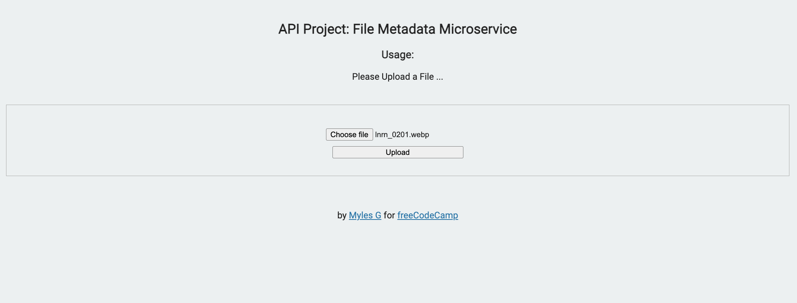
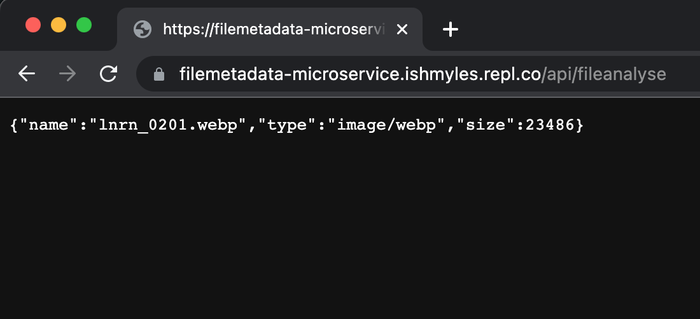

# File Metadata Microservice

This is the solution code for the URL Shortener Microservice project on [freeCodeCamp](https://www.freecodecamp.org/learn/back-end-development-and-apis/back-end-development-and-apis-projects/file-metadata-microservice). The live solution can be viewed [here](https://filemetadata-microservice.ishmyles.repl.co/).

## Screenshots

### Example json response #1 (Return file metadata after uploading)

